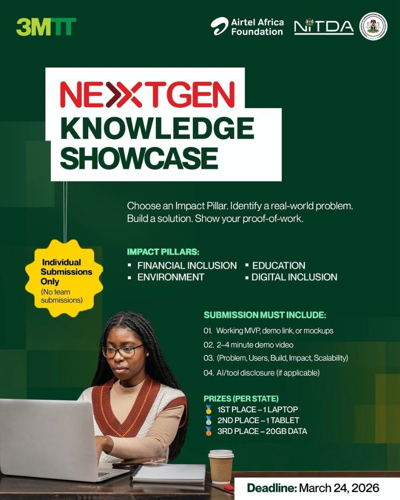

# WasteWise AI 🌍



🔥 **Live MVP Demo:** [https://wastewise-ai.vercel.app](https://wastewise-ai.vercel.app)

> **Predict waste. Prioritize pickup. Keep communities clean.**

WasteWise AI is an intelligent civic tech dashboard and reporting platform designed for urban waste management in Abuja. Built as a pilot for the NextGen Knowledge Showcase (3MTT/NITDA), this MVP demonstrates how predictive models can transition city sanitation agencies from reactive cleanups to proactive, data-driven dispatching.

---

## 🎯 The Problem
In rapidly expanding urban centers like Abuja, waste management agencies rely heavily on reactive cleanup. Collection trucks operate on static routes, entirely unaware of localized overflow crises until severe environmental hazard or public complaint occurs. This leads to inefficient fuel usage, aesthetic degradation of communities, and increased public health risks.

## 👥 Primary Users
1. **Urban Households**: Reporting waste levels, missed pickups, or illegal dumping via a simplified mobile-friendly web form.
2. **Waste Collection Supervisors (AEPB)**: Reviewing demand, tracking predicted overflow risks, and planning optimal daily pickup routing.

## ✨ Core Features
- **Responsive Household Reporting Flow**: Easy-to-use form capturing waste types, severity, and exact district locations constraints.
- **Smart Prediction Engine**: Calculates real-time priority scores (0-100) using a local intelligence layer (K-Nearest Neighbors).
- **Executive Dashboard**: A mission-control interface featuring KPIs, live recent reports, and high-risk zone categorization.
- **Predictive Routing**: Automatically generates a recommended dispatch route for trucks targeting critical areas.
- **Live Demo Data Explorer**: Seamless insight into the SQLite-backed seed dataset simulating 60 real Abuja incidents.

---

## 🛠️ Tech Stack
- **Framework**: Next.js 15 (App Router)
- **Language**: TypeScript
- **Styling**: Tailwind CSS & custom deep-emerald civic theme
- **UI Components**: shadcn/ui (Radix + Tailwind)
- **Icons**: Lucide React
- **Database**: Prisma ORM with SQLite (Real local backend for MVP portability)
- **AI/ML Layer**: `ml-knn` (K-Nearest Neighbors implementation for predictive scoring)
- **Deployment**: Vercel

---

## 🧠 How the AI Scoring Works
The system uses a tailored K-Nearest Neighbors (KNN) model to categorize risk, supplemented by a weighted continuous score logic. 

**Data Inputs Analyzed:**
1. **Urgency Level**: Resident subjective assessment (Low, Medium, High, Critical).
2. **Waste Type Severity**: E.g., Organic waste decays faster than recycling and carries a higher base severity multiplier.
3. **Temporal Density**: Elapsed time since the issue was reported.
4. **Geographic Clustering**: Frequency of missed pickup reports within the same zone.

The algorithm predicts a base Priority Class (Low to Critical) and assigns a granular Risk Score (0-100). If a zone surpasses 75/100, it is immediately flagged as a **High Risk / Target Zone** on the dispatch dashboard map.

---

## 🚀 How to Run Locally

### Prerequisites
- Node.js (v18+)
- npm or yarn

### Setup Steps
1. **Clone the repository:**
   ```bash
   git clone https://github.com/your-username/wastewise-ai.git
   cd wastewise-ai
   ```

2. **Install Dependencies:**
   ```bash
   npm install
   ```

3. **Initialize the Database & Seed Mock Data (Abuja Demo):**
   ```bash
   npx prisma db push
   npx tsx prisma/seed.ts
   ```
   *This creates a local `dev.db` SQLite file and populates it with ~60 realistic waste reports across Abuja districts (Wuse, Garki, Jabi, etc).*

4. **Start the Development Server:**
   ```bash
   npm run dev
   ```

5. **Open in Browser:**
   Navigate to [http://localhost:3000](http://localhost:3000)

---

## 🌐 How to Deploy (Vercel)
This Next.js app is pre-configured for seamless deployment to Vercel.

1. Ensure the app is pushed to your GitHub account.
2. Log into the Vercel Dashboard and click **Add New... > Project**.
3. Import the `wastewise-ai` repository.
4. **Important**: Since this MVP uses a local SQLite file (`dev.db`) for demonstration purposes, Vercel will treat the database statelessly across serverless invocations. For a fully productionized version, replace the SQLite provider with PostgreSQL (Supabase/Neon) in the `schema.prisma`.
5. Click **Deploy**.

---

## 📂 Folder Structure
```
wastewise-ai/
├── prisma/
│   ├── schema.prisma      # DB Schema and models
│   └── seed.ts            # Abuja realistic mock data generator
├── src/
│   ├── app/
│   │   ├── about/         # Impact and Scalability Page
│   │   ├── dashboard/     # Main Admin/Dispatcher UI
│   │   ├── data/          # Demo dataset transparent viewer
│   │   ├── insights/      # AI engine explanation page
│   │   ├── report/        # Public household reporting form
│   │   ├── globals.css    # Custom Tailwind civic-tech theme
│   │   ├── layout.tsx     # Root Next.js layout (Nav/Footer)
│   │   └── page.tsx       # Landing Page
│   ├── components/
│   │   ├── layout/        # Navbar, Footer
│   │   └── ui/            # Auto-generated shadcn/ui components
│   ├── lib/
│   │   ├── ai.ts          # Core KNN Prediction Engine Logic
│   │   └── utils.ts       # Tailwind css class merger
│   └── types/             # TypeScript declaration files
```

---

## 🔮 Future Roadmap
- **Phase 1**: Pilot testing with AEPB dispatch supervisors using the current MVP.
- **Phase 2**: Integration of **IoT Bin Sensors** to trigger localized reports natively without human input.
- **Phase 3**: Migrate to a heavy-duty PostgreSQL cloud database (Supabase).
- **Phase 4**: Expansion of the geographic boundaries to encompass Lagos and Kano mapping.

---
*Developed for the NextGen Knowledge Showcase AI/ML Track.*
